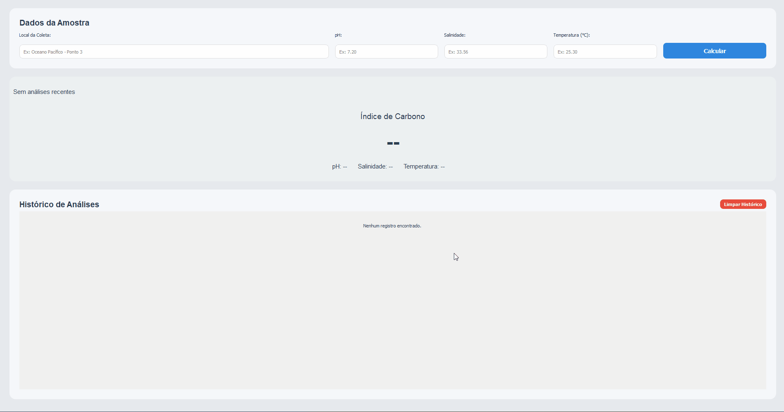

<div align="center">

# 🌊 WaterAnalyser

### *Dissolved Inorganic Carbon (DIC) Prediction Tool*

[](https://www.python.org/)
[](https://www.riverbankcomputing.com/software/pyqt/)
[](https://scikit-learn.org/)
[](LICENSE.txt)



*Estimate Dissolved Inorganic Carbon from pH, salinity and temperature using machine learning*

</div>

---

## 📖 Introduction

**WaterAnalyser** is a research-driven application that estimates **Dissolved Inorganic Carbon (DIC)** concentration in water samples using easily measurable field parameters: **pH**, **salinity**, and **temperature**.

Built on a **Random Forest regression model**, this tool bridges the gap between simple water quality measurements and complex carbon chemistry analysis, making DIC estimation accessible without expensive laboratory equipment.

### ✨ Key Features

- 🎯 **Accurate Predictions** — Machine learning model trained on real oceanographic data
- 🖥️ **User-Friendly GUI** — Intuitive PyQt5 interface for quick measurements
- 📊 **History Tracking** — SQLite database stores all your analyses
- 🔒 **Secure Data** — Encrypted training dataset with Fernet encryption
- 📦 **Ready-to-Use** — Windows installer available for easy deployment

---

## 👥 Credits

This software was developed through a collaborative research effort:

<table>
<tr>
<td align="center" width="50%">
<b>Augusto Ferrarese</b><br/>
<i>Chemical Technician</i><br/>
<a href="https://www.linkedin.com/in/augusto-sturmer-ferrarese-362723311/">LinkedIn</a>
</td>
<td align="center" width="50%">
<b>Prof. Schana Andreia da Silva</b><br/>
<i>Project Supervisor</i><br/>
<a href="https://www.linkedin.com/in/schana-andreia-da-silva-br123/">LinkedIn</a>
</td>
</tr>
</table>

---

## 🚀 Quick Start - Try It Now!

### 📥 Download the Installer

Want to test WaterAnalyser without setting up a development environment?

**[Download the latest installer from GitHub Releases](https://github.com/PedroSilvaScheid/OceanWaterAnalysis/releases/latest)**

The installer will:

1. ✅ Install the application to `Program Files`
2. ✅ Create desktop and start menu shortcuts
3. ✅ Optionally configure the encryption key (if you have access)
4. ✅ Set up everything needed to run the application

> ⚠️ **Note:** The application comes with pre-trained models, so you can start making predictions immediately. The encryption key is only needed if you want to retrain the model with the original dataset.

---

## 🛠️ Technology Stack

<table>
<tr>
<td valign="top" width="50%">

### 📁 Project Architecture

```
OceanWaterAnalysis/
├── src/
│   ├── app.py                    # Application entry point
│   ├── gui/                      # PyQt5 interface components
│   │   ├── main_window.py
│   │   ├── styles.py
│   │   └── components/           # Reusable UI widgets
│   ├── core/                     # Business logic
│   │   ├── prediction.py         # ML model & training
│   │   ├── database.py           # SQLite operations
│   │   └── controllers/          # Application controllers
│   └── utils/                    # Helper functions
│       ├── crypto.py             # Encryption utilities
│       ├── paths.py              # Path management
│       └── COMPLETO.csv.enc      # Encrypted training data
├── packaging/                    # Platform-specific installers
│   └── windows/
│       └── installer.nsi         # NSIS configuration
├── build.py                      # Build orchestration script
└── requirements.txt              # Python dependencies
```

### 🔄 How It Works

The application uses a **Random Forest** regression model trained on the relationship between:

- **Features:** pH, Salinity (psu), Temperature (°C)
- **Target:** Dissolved Inorganic Carbon (μmol/kg)

**Workflow:**

1. User inputs water sample parameters through the GUI
2. Application loads pre-trained model (or trains new one if needed)
3. Model predicts DIC concentration
4. Result is displayed and stored in local SQLite database
5. History of all analyses is maintained for reference

---

## 💻 Development Setup

### Prerequisites

- Python 3.11 or higher
- Windows OS (for building installer)
- Git

### Installation Steps

1️⃣ **Clone the repository**

```powershell
git clone https://github.com/PedroSilvaScheid/OceanWaterAnalysis.git
cd OceanWaterAnalysis
```

2️⃣ **Create and activate virtual environment**

```powershell
python -m venv venv
.\venv\Scripts\Activate
```

3️⃣ **Install dependencies**

```powershell
pip install --upgrade pip
pip install -r requirements.txt
```

4️⃣ **Configure encryption key** (if you have access)

```powershell
$env:CSV_ENC_KEY = "YOUR_BASE64_KEY_HERE"
```

5️⃣ **Run the application**

```powershell
python src\app.py
```

### 🔑 First Run Behavior

- **With encryption key:** The app will decrypt the training dataset and train the model on first launch (takes ~30 seconds)
- **Without encryption key:** The app will use pre-trained models if available, or display an error

Training metrics (R², MSE) are displayed in the console during model training.

---

## 🏗️ Building from Source

To create the Windows installer:

```powershell
python build.py
```

This will:

1. Run PyInstaller to bundle the application
2. Create the NSIS installer with custom branding
3. Generate `dist/WaterAnalyser_Setup_1.0.0.exe`

### Build Artifacts

- `dist/WaterAnalyser/` — Portable application folder
- `dist/WaterAnalyser_Setup_1.0.0.exe` — Windows installer

---

## 🤝 Contributing

We welcome contributions! Here's how you can help:

### For General Contributors

- 🐛 Report bugs by opening an issue
- 💡 Suggest features or improvements
- 📖 Improve documentation
- 🔧 Submit pull requests

### For Research Collaborators

If you're interested in accessing the **encrypted training dataset** or contributing to the model development:

**Contact Pedro Scheid:**

- 💼 [LinkedIn](https://www.linkedin.com/in/pedro-scheid/)
- 📩 [Email](mailto:pedro.scheid03@gmail.com)

> 🔐 The encryption key is shared only with verified research partners to protect sensitive oceanographic data.

---

## 📄 License

This project is proprietary software. See [`LICENSE.txt`](LICENSE.txt) for usage terms and restrictions.

---
